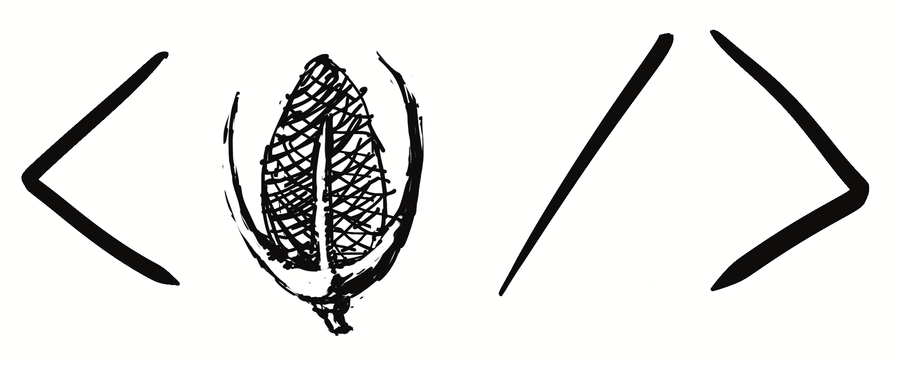

# Teasel

> Teasing HTML elements from palin text

Parser is be split into three parts:

 * Tokeniser which produces tokens for each character in the input.
 * Untyped tree. A red-green tree implemenation and builder.
 * Typed tree. A structured wrapper around the untyped tree for ergonomics.
 * Parser a parser which builds a syntax tree from the tokens.

## Tokenisation

We will transform the input text into a series of tokens. All parts of the input
should be covered by a token, including trivia.

## Parse

A hand written top down parser with one token lookahead. This uses a green tree
builder to produce a syntax tree.

## Tree

Red-green syntax tree and typed tree. The typed wrapper will have classes
specific to each node type. THe tree should be capable of representing any kind
of incomplete or malformed syntax. The tree should be faithful to the source
text. Semanitc transformation into a DOM is _not_ the intent of this library.

## 🐲 TODO 🐲:

 * [x] Handle attributes on opening tags
 * [x] Better error recorvery when `expect` fails.
   * [x] Tolerate and warn on some malformed whitespace. e.g.: `< p>`.
   * [x] Malformed attribute lists syncrhonise on `>`.
 * [x] Node cache should cache nodes in the green tree builder.
  * [x] Node cache interface and implementaiton.
  * [x] Parser should accept optional cache.
 * [x] Handle Closing of outer tags correctly. e.g.: `
<i>hello
`.
 * [ ] Handle Closing of non-nesting sibilings. e.g.: `<li>a<li>b`.
 * [x] Handling for implicit self closing of 'void' elements `
` etc.
 * [ ] Support for raw text.
  * [ ] Handling of raw text elements. e.g. `script`, and `style`.
  * [ ] Support for `CDATA` values / tokens.
 * [ ] Document and fragment parse APIs.
 * [ ] Syntax builder / factory API for creating and updating nodes.
